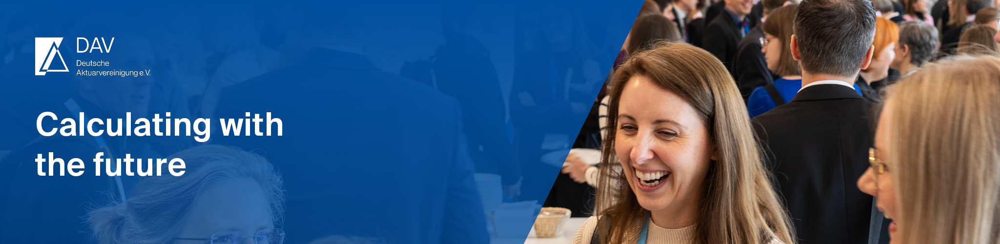

The German Association of Actuaries (Deutsche Aktuarvereinigung e.V., DAV) is the professional representation of all actuaries in Germany. 
It was founded in 1993 and has more than 6,700 members today. More than 900 members are involved in thirteen committees and in over 60 working 
groups as a voluntary commitment.

The given repositories have been created by committees and working groups and serve as an aid for our members and interested persons to support them 
in their work with machine learning methods and data science issues in an actuarial context.

# Working group results

- [Avoidance of Discrimination and Bias in Modeling](https://github.com/DeutscheAktuarvereinigung/WorkingGroup_Bias_Discrimination_Notebooks/) Notebooks with tools to assess fairness or improve it  
- [eXplainableAI](https://github.com/DeutscheAktuarvereinigung/WorkingGroup_eXplainableAI_Notebooks)  Notebooks with toy examples, reimplementations, simulation studies and SCR use case 
- [Big Data in Life insurance](https://github.com/DeutscheAktuarvereinigung/Deriving-NHANES-data-set-CDC-for-mortality-analysis) (with the Life section) script to create a 
data set for mortality analysis from the NHANES data set  
- [Modelling of Cyber risks](https://github.com/DeutscheAktuarvereinigung/Use-Case-zur-Modellierung-von-Cyberrisiken)  (with the General insurance section)
- [Migration of life insurance portfolios](https://github.com/DeutscheAktuarvereinigung/portxlpy) (with the Life section) Porting Excel insurance tariff calculations to Python

# Use Cases

See [here](https://aktuar.de/en/practice-areas/data-science/use-cases/Pages/default.aspx) for more detailed descriptions.

1. [Claim frequency modeling](https://github.com/DeutscheAktuarvereinigung/claim_frequency)  
2. [Insurance SCR data](https://github.com/DeutscheAktuarvereinigung/insurance_scr_data)
3. [Mortality modeling](https://github.com/DeutscheAktuarvereinigung/Mortality_Modeling)  
4. [Forecasting rare events](https://github.com/DeutscheAktuarvereinigung/ADS_Use_Cases) on credit scoring 

# Data Science Challenges

- 2022 [Claim Frequency Modeling](https://github.com/DeutscheAktuarvereinigung/Data_Science_Challenge_2022_Python-Notebook_zur_Erstellung_von_Schadenhaeufigkeitsmodellen)
- 2021 [Explainable Machine Learning](https://github.com/DeutscheAktuarvereinigung/Data-Science-Challenge2021_Explainable-Machine-Learning)
- 2020 [Disability](https://github.com/DeutscheAktuarvereinigung/Data_Science_Challenge_2020_Berufsunfaehigkeit) and 
[Fraud Detection](https://github.com/DeutscheAktuarvereinigung/Data_Science_Challenge_2020_Betrugserkennung)

# Training

- [Python for Actuaries](https://github.com/DeutscheAktuarvereinigung/Python_fuer_Aktuare)

# Best Notebook Awards 
- [Winning notebooks of 2024 CADS Immersion class](https://github.com/DeutscheAktuarvereinigung/2024_CADS_Immersion_Best_Notebooks) on house price prediction for fire insurance

# Disclaimer

Please note that the repositories provided on GitHub are published by the DAV. The content of linked websites is the sole responsibility 
of their operators. The DAV is not responsible for the code and data linked to external sources.
